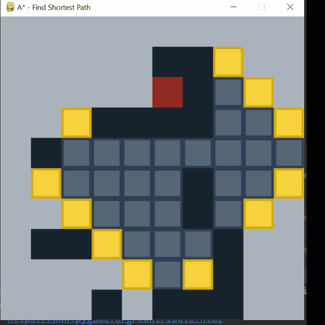

# A star path finding in matrix
In this repo we'll Find the shortest path in matrix (with Connected Edges and without it) by A*


## Quick start :

First of all
```python
pip install pygame
```
Than :
1. Create a matrix with this Type:
    
    - WALL = 1
    - START = 2
    - GOAL = 3
    
```python
    matrix = [
        [0, 0, 0, 0, 0, 0, 0, 0, 0, 0],
        [0, 0, 0, 0, 0, 0, 0, 0, 3, 0],
        [0, 0, 0, 0, 0, 0, 0, 0, 0, 0],
        [0, 0, 1, 1, 1, 1, 1, 0, 0, 0],
        [0, 1, 0, 0, 0, 0, 0, 1, 0, 0],
        [0, 1, 0, 0, 0, 1, 0, 0, 0, 0],
        [0, 0, 0, 0, 0, 0, 1, 0, 0, 0],
        [0, 1, 1, 1, 0, 0, 0, 1, 0, 0],
        [0, 0, 0, 0, 0, 2, 0, 1, 0, 0],
        [0, 0, 0, 1, 1, 1, 1, 1, 0, 0],
    ]
```

2. Create an object of Astar class
```python
astar = Astar(matrix, 1)
```
3. Create Display object and pass astar to it and call show() method
```python
 Display(astar).show()
```
---
##Find Path With Connected Edges
```python
astar = Astar(matrix, 1, conected=True)
Display(astar).show()
```


----
## 8 Direction 

```python
astar = Astar(matrix, 1, conected=True , eight_direction=True)
Display(astar).show()
```


----
## Alpha
Second parameter in this solver is Alpha variable that determined that search algorithm be on of **THIS** :

1. Uniform Cost (0)
 ```python
astar = Astar(matrix, 0)
```


----
2. A* (1)
```python
astar = Astar(matrix, 1)
```


----
3. Greedy (2)
```python
astar = Astar(matrix, 2)
```


As you can see Uniform Cost and A star is optimal

----
### Heuristic: 
Pythagoras Formula

```python
self.h = ((abs(row_goal - row) ** 2) + abs(col_goal - col) ** 2) ** .5
```
